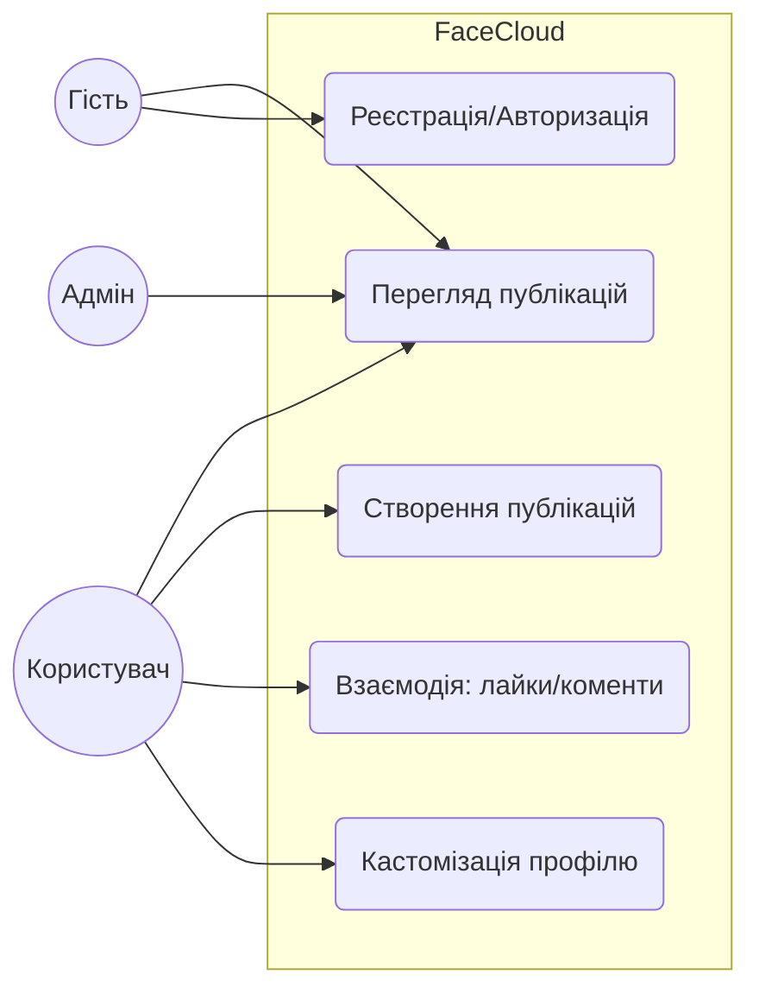
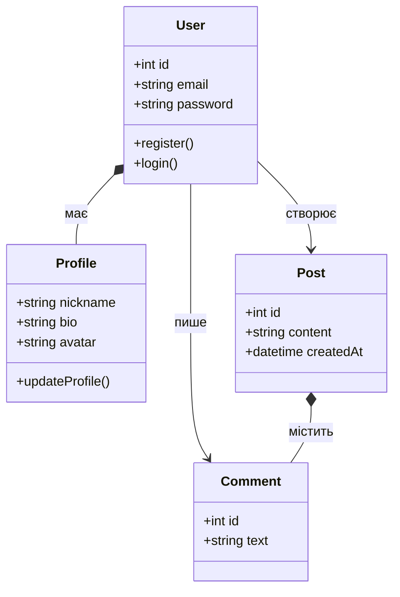
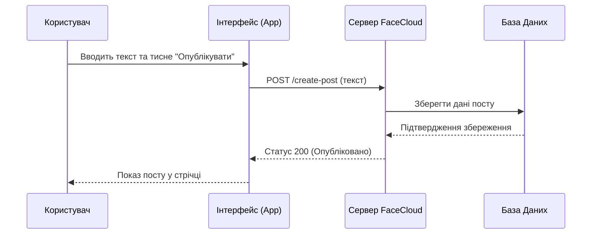

# Проєкт FaceCloud — Специфікація вимог (SRS)

## 1. Вступ
* **Продукт:** Платформа для створення та управління цифрові спільноти.
* **Проблема:** Перевантаженість популярних соцмереж рекламою.
* **Цільова аудиторія:** 18-45 років, технічний рівень — мінімальний.
* **Бізнес-мета:** Прибуток через “преміум” підписку.

## 2. Функціональні вимоги (FR)
* **FR-01:** Реєстрація та авторизація.
* **FR-02:** Створення публікацій (можливість постити).
* **FR-03:** Стрічка новин (перегляд публікацій).
* **FR-04:** Взаємодія з контентом (лайки, репости, коменти).
* **FR-05:** Кастомізація власного профілю.
* **FR-06:** Пошук за тегами.

## 3. Діаграми

### 3.1. Діаграма прецедентів (Use Case)

### 3.2. Діаграма класів (Class Diagram)

### 3.3. Діаграма послідовності (Sequence) — Створення публікації

## 4. Матриця відстежуваності (Traceability Matrix)
| ID вимоги | Назва вимоги | Діаграма (Use Case) | Задіяні класи |
| :--- | :--- | :--- | :--- |
| **FR-01** | Реєстрація/Авторизація | UC2: Реєстрація/Авторизація | User |
| **FR-02** | Створення публікацій | UC3: Створення публікацій | User, Post |
| **FR-03** | Стрічка новин | UC1: Перегляд публікацій | Post, User |
| **FR-04** | Взаємодія з контентом | UC4: Взаємодія: лайки/коменти | User, Post, Comment |
| **FR-05** | Кастомізація профілю | UC5: Кастомізація профілю | User, Profile |

**Виконали: Мартовицький В. Качурін М.**
